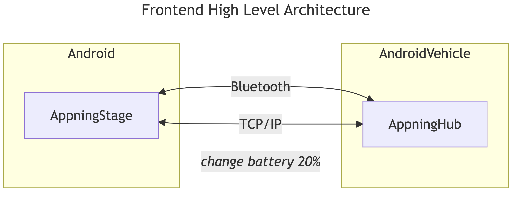

# Forvia Appning Stage - Quick Setup Guide

## Overview

The **Appning Stage** app is designed to **send mock vehicle data** to the in-vehicle infotainment system for testing purposes. It does this by transmitting data via **Bluetooth (for real devices)** or **TCP (for emulators)**.

The **[Appning Hub](<https://github.com/faurecia-aptoide/appning-hub>)** acts as the receiver, collecting this vehicle data and using it to **display targeted ads** and other relevant content on the infotainment system.

This allows developers and testers to **simulate different driving scenarios**—such as changes in **location, fuel level, and fuel type**—without needing a physical vehicle, ensuring **accurate ad targeting** and **infotainment system behavior validation**.





## Connecting via Bluetooth
1. **Enable Bluetooth** in system settings.
2. **Pair the Device**: Go to **Bluetooth settings**, scan, and pair with the device.
3. **Launch the Appning Stage app** and tap **Scan Paired Devices**.
4. **Select the paired device** to connect.
5. **Connection Established**: Data starts transmitting once connected.

## Connecting via TCP (Emulators)
1. **Ensure TCP connection is configured** for the emulator.
2. **Run the following ADB command** to forward the TCP port (8080) on the emulator to the Appning Hub: **adb -s emulator-5554 forward tcp:8080 tcp:8080** 
3. This command ensures that the emulator can communicate with the Appning Hub over the TCP protocol on port 8080. Make sure the emulator device ID (`emulator-5554`) matches your running instance.
4. Start the Appning Stage app, and click on connect button.

## Data Transmitted
Log example when sending data:

```json
{
  "demoMode": true,
  "fuelLevel": 50.0,
  "fuelType": [1],
  "location": [40.7128, -74.0060],
  "override": ["fuelType", "location", "fuelLevel"]
}
```

## Data Breakdown:
- **demoMode**: Indicates simulated data (`true`) or real-time data (`false`).
- **fuelLevel**: Vehicle’s fuel level.
-   **Fuel type codes**:  
  - `1` = Gasoline (or other non-electric vehicles)  
  - `10` = Electric
- **location**: Latitude & Longitude of the vehicle.
- **override**: Custom data (if any).

## Troubleshooting

#### 1. Check Connection Logs
- Look for **"Connection Established"** in the **Appning Hub** and **Appning Stage** logs.
- If not connected, ensure **Bluetooth** (for real devices) or **TCP connection** (for emulators) is set up correctly.
- Ensure the device is paired and communicating properly.

**Tip:** Restart the devices or reboot the emulator if the connection fails.

#### 2. Verify Data Flow
- After the connection is established, make sure the **Appning Hub** shows correct data (fuel level, location, etc.).
- If data is missing or incorrect, verify the app is transmitting the expected information.

**Tip:** Double-check the app’s data format in the logs for accuracy.

#### 3. Enable Debug Logs
- If you need more details, enable **debug mode** to track data transmission.
- Debug logs show exactly what data is being sent, including vehicle info like fuel level and location.

**Tip:** Debug logs can help identify missing data or errors in transmission.

#### 4. Check Emulator/Device Settings
- For emulators, make sure the **TCP connection** is correctly forwarded.
- For real devices, confirm **Bluetooth** is enabled and the device is paired.

**Tip:** For emulators, ensure the correct ADB command and device ID are used.

#### 5. Reboot Devices
- If nothing works, try restarting both the **Appning Stage** app and the **Appning Hub** device to fix any stuck connections.


